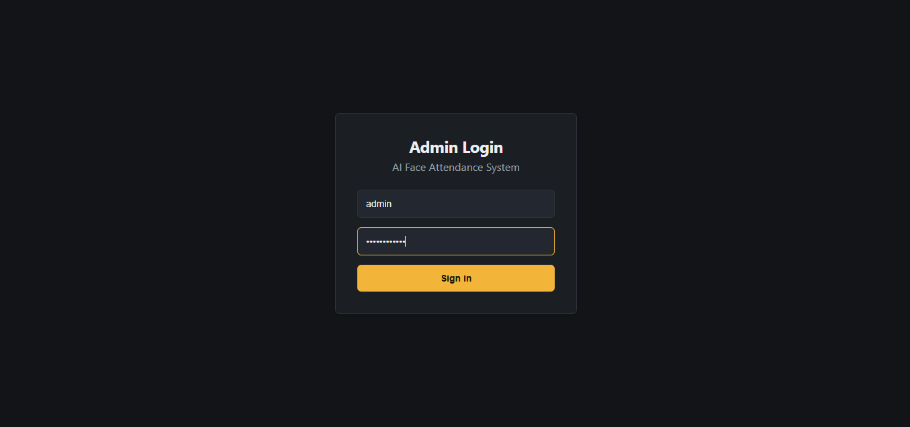
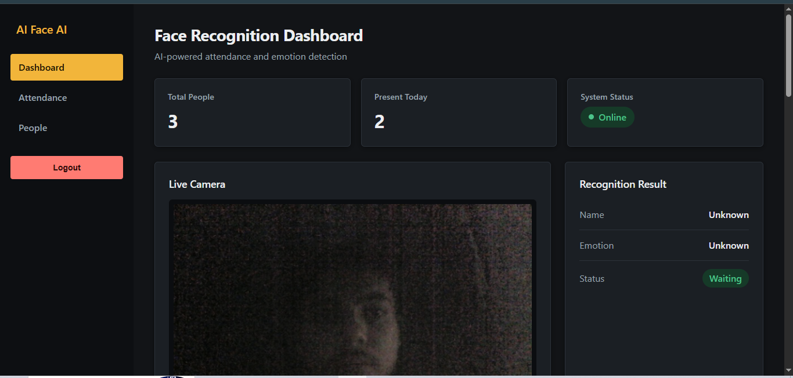
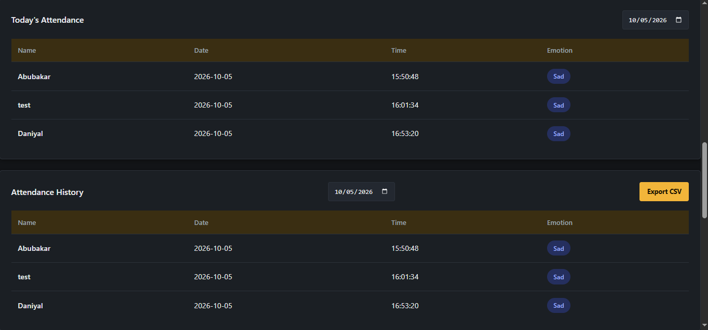
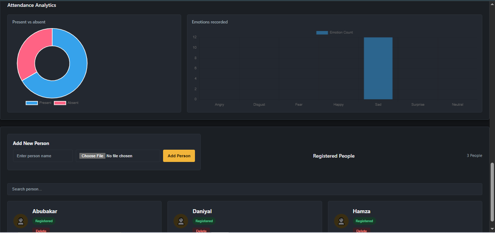

# AI Face Recognition, Emotion Detection & Attendance System

An AI-powered **Face Recognition, Emotion Detection, and Attendance Management System** built with Python, OpenCV, Flask, and ONNX deep learning models.

The system recognizes registered people through a webcam, detects their emotions, automatically records attendance, and provides a web-based dashboard for monitoring and analytics.

---

## Features

* Real-time face detection using **YuNet**
* Face recognition using **SFace**
* Recognition of multiple registered people
* Facial emotion estimation using **MobileFaceNet**
* Automatic attendance recording
* Daily duplicate-attendance prevention
* CSV-based attendance storage
* Dynamic loading of registered faces from the `known_faces` folder
* Flask-based web dashboard
* Admin login authentication
* Live camera feed
* Real-time recognition and emotion status
* Attendance summary with present/absent statistics
* Attendance history with date filtering
* CSV attendance export
* Registered people management
* Add and delete registered people
* Individual person attendance and emotion details
* Attendance analytics and emotion charts
* Responsive mobile-friendly interface
* Pakistan timezone support (`Asia/Karachi`)

---

## Screenshots

### Login Page



### Dashboard



### Attendance History



### People Management




## Technologies Used

* Python
* OpenCV
* Flask
* NumPy
* Pandas
* ONNX Runtime
* YuNet
* SFace
* MobileFaceNet
* HTML
* CSS
* JavaScript
* Chart.js
* CSV

---

## Project Structure

```text
AI_Face_Emotion/
│
├── .vscode/
│
├── attendance/
│   └── attendance_emotion.csv
│
├── known_faces/
│   ├── Abubakar/
│   ├── Daniyal/
│   └── Hamza/
│
├── models/
│   ├── face_detection_yunet_2026may.onnx
│   ├── face_recognition_sface_2021dec.onnx
│   └── facial_expression_recognition_mobilefacenet_2022july.onnx
│
├── static/
│   └── style.css
│
├── templates/
│   ├── index.html
│   └── login.html
│
├── .gitignore
├── app.py
├── attendance_emotion.py
├── load_faces.py
├── README.md
└── requirements.txt
```

---

## Installation

### 1. Create Conda Environment

```bash
conda create -n faceai python=3.12
```

Activate the environment:

```bash
conda activate faceai
```

### 2. Install Dependencies

```bash
pip install -r requirements.txt
```

### 3. Run the Application

Start the Flask application:

```bash
python app.py
```

The application will run at:

```text
http://127.0.0.1:5000/
```

Open this address in your web browser to access the **AI Face Recognition Dashboard**.

### 4. Login

The dashboard is protected by admin authentication.

Use the configured admin username and password to log in.

> **Note:** For production deployment, configure the admin credentials and Flask secret key using environment variables.

---

## Add Registered Faces

Create a separate folder for each person inside `known_faces`.

Example:

```text
known_faces/
│
├── Abubakar/
│   └── 1.jpg
│
├── Hamza/
│   └── hamza.jpg
│
└── Daniyal/
    └── 1.jpg
```

The folder name is used as the person's name during face recognition.

You can also add and delete registered people directly from the **People** section of the web dashboard.

---

## Attendance

When a registered person is recognized, the system automatically records:

* Name
* Date
* Time
* Detected emotion

Attendance is saved in:

```text
attendance/attendance_emotion.csv
```

Example:

```csv
Name,Date,Time,Emotion
Abubakar,2026-10-03,04:33:08,sad
Hamza,2026-10-03,04:35:12,happy
Daniyal,2026-10-04,02:30:18,sad
```

The system prevents the same person from being marked multiple times on the same day.

The dashboard provides:

* Today's attendance summary
* Present and absent statistics
* Attendance percentage
* Attendance history
* Date filtering
* CSV export
* Individual person attendance details
* Attendance analytics
* Emotion analytics

The application uses the **Pakistan timezone (`Asia/Karachi`)** for attendance dates and times.

---

## How It Works

The system follows this pipeline:

```text
Webcam
   ↓
Face Detection (YuNet)
   ↓
Face Recognition (SFace)
   ↓
Identify Person
   ↓
Emotion Detection (MobileFaceNet)
   ↓
Attendance Recording
   ↓
CSV Storage
   ↓
Web Dashboard & Analytics
```

### Face Detection

**YuNet** detects faces from the live webcam feed.

### Face Recognition

**SFace** generates a face representation and compares it with registered face data from the `known_faces` folder.

If a matching registered face is found, the person's name is identified.

### Emotion Detection

**MobileFaceNet** analyzes the recognized face and estimates the detected facial emotion.

The system supports emotions such as:

```text
Angry
Disgust
Fear
Happy
Sad
Surprise
Neutral
```

### Attendance

When a registered person is successfully recognized, the system records:

* Person's name
* Date
* Time
* Detected emotion

The attendance record is saved in:

```text
attendance/attendance_emotion.csv
```

The system prevents the same person from being marked multiple times on the same day.

### Web Dashboard

The Flask dashboard provides:

* Live camera feed
* Recognition result
* Detected emotion
* Attendance summary
* Attendance history
* People management
* Person details
* CSV export
* Attendance analytics
* Emotion analytics

---

## Important Note

The system requires the ONNX models to be present inside the `models` folder.

Registered face images should be placed inside the `known_faces` folder.

For better recognition accuracy, use clear and properly lit face images.

The system is designed for local development and demonstration purposes. Additional security and deployment configuration should be added before using it in a production environment.

---

## Future Improvements

Possible future improvements include:

* Cloud database integration
* Email notifications
* WhatsApp notifications
* Automated daily attendance reports
* More advanced emotion recognition
* Multi-camera support
* Role-based user authentication
* Cloud deployment
* AI-powered attendance insights
* Employee management features
* REST API integration

---

## Project Goal

The goal of this project is to combine **Face Recognition, Emotion Detection, and Attendance Automation** into a practical AI application.

It demonstrates how computer vision and deep learning models can be integrated with a Flask web application to create a real-world AI automation system.
